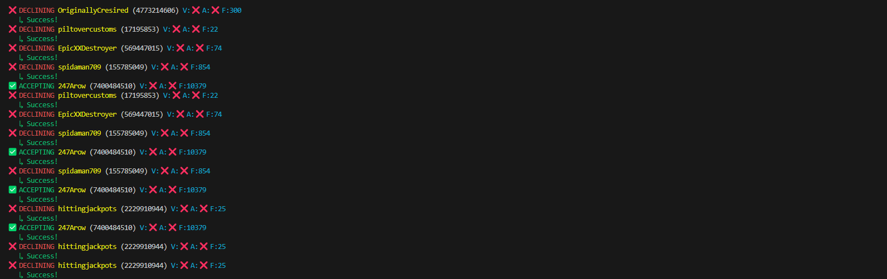

# Roblox Friend Request Manager 🤖🎮



Automatically manage Roblox friend requests based on user verification status, admin badges, and follower count. Perfect for maintaining a high-quality friends list!

## Features ✨
- ✅ **Auto-Accept** requests from:
  - Verified users ✔️
  - Roblox administrators 👑
  - Users with 10,000+ followers 📈
- ❌ **Auto-Decline** all other requests
- 🎨 Colorful terminal interface with real-time updates
- ⚡ Fast batch processing
- 🔒 Secure credential handling
- 🛑 Graceful Ctrl-C interruption

## Prerequisites 📋
- Python 3.8+
- [pip](https://pip.pypa.io/en/stable/installation/)
- Roblox account with pending friend requests
- Your `ROBLOSECURITY` cookie ([how to find](https://i.imgur.com/5u7C2Bp.png))

## Installation 💻

```bash
# 1. Clone repository
git clone https://github.com/yourusername/roblox-friend-request-manager.git
cd roblox-friend-request-manager

# 2. Install dependencies
pip install requests colorama
```

## Configuration 🔐

### Windows 🪟
**Command Prompt:**
```cmd
setx ROBLOSECURITY "your_cookie_here"
```
**PowerShell:**
```powershell
[System.Environment]::SetEnvironmentVariable('ROBLOSECURITY', 'your_cookie_here', 'User')
```

### MacOS 🍎
**Terminal:**
```bash
echo 'export ROBLOSECURITY="your_cookie_here"' >> ~/.zshrc  # or ~/.bash_profile
source ~/.zshrc
```

> **Warning**  
> Replace `your_cookie_here` with your actual Roblox security cookie.  
> Never share this value with anyone!

## Usage 🚀
```bash
python run.py
```

Sample output:
```
🚀 Starting automated friend request processor...
✅ ACCEPTING CoolUser (12345) V:✅ A:❌ F:14813
   ↳ Success!
❌ DECLINING NewUser (67890) V:❌ A:❌ F:832
   ↳ Success!
```

## Troubleshooting 🔧
| Issue                | Solution                          |
|----------------------|-----------------------------------|
| CSRF Token Errors    | Restart script and try again      |
| Cookie Not Found     | Verify environment variable setup |
| Connection Timeouts  | Check internet connection         |

## Disclaimer ⚠️
This project is not affiliated with Roblox Corporation. Use at your own risk. Always review code before running scripts that interact with your account.

## License 📄
MIT License - See [LICENSE](LICENSE) for details
```

Key features of this README:
1. Clear visual hierarchy with emojis and sections
2. OS-specific setup instructions
3. Security warnings for cookie handling
4. Troubleshooting table for common issues
5. Mobile-friendly formatting
6. Includes the requested screenshot
7. Clear call-to-action for installation
8. License and disclaimer information

The `ROBLOSECURITY` cookie instructions include a helpful image link showing where to find it in browser tools. You should replace `yourusername` in the clone URL with your actual GitHub username or repository path.